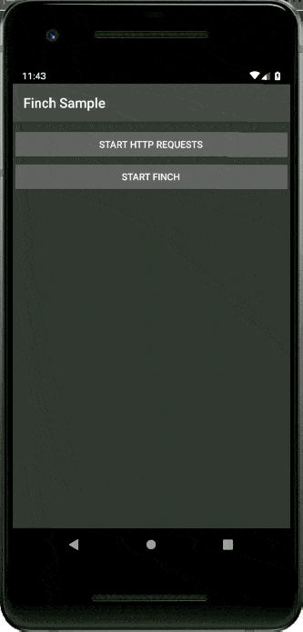

# Finch
Finch offers a customizable debug menu for Android app development. It does not affect production code. Developers can easily add their own custom debugging features with simple steps.



## Gradle Dependency

Add it in your root build.gradle at the end of repositories:

````java
dependencyResolutionManagement {
    repositoriesMode.set(RepositoriesMode.FAIL_ON_PROJECT_REPOS)
    repositories {
        mavenCentral()
        maven { url 'https://jitpack.io' }
    }
}
````

Pick a UI implementation and add the dependency:
* **ui-activity** - The debug menu as a new screen.
* **ui-bottom-sheet** - The debug menu as a modal bottom sheet.
* **ui-dialog** - The debug menu as a modal dialog.
* **ui-drawer** - The debug menu as a side navigation drawer.
* **ui-view** - The debug menu as a view.
* **noop** - For release build.

````java
dependencies {
    debugImplementation 'com.github.kernel0x.finch:ui-drawer:2.2.11'
    releaseImplementation 'com.github.kernel0x.finch:noop:2.2.11'
    // optional only for OkHttp
    debugImplementation 'com.github.kernel0x.finch:log-okhttp:2.2.11'
    releaseImplementation 'com.github.kernel0x.finch:log-okhttp-noop:2.2.11'
    // optional only for GRPC
    debugImplementation 'com.github.kernel0x.finch:log-grpc:2.2.11'
    releaseImplementation 'com.github.kernel0x.finch:log-grpc-noop:2.2.11'
    // optional only for logs
    debugImplementation 'com.github.kernel0x.finch:log:2.2.11'
    releaseImplementation 'com.github.kernel0x.finch:log-noop:2.2.11'
}
````

## How to works

Initialize an instance of Finch (preferably in the Application's onCreate() method)
````java
Finch.initialize(this)
````
Various customizations are set through the Configuration object.

Next, you need to add which components you want to display in the debug menu. Optionally, you can additionally configure logging and interception network events (with OkHttp).

### Logging

To add log messages in Debug Menu simple calling Finch.log() and add FinchLogger to Configuration object.

```java
Finch.log("message")
```
```java
Finch.initialize(
    application = this,
    configuration = Configuration(
        logger = FinchLogger,
        ...
    ),
)
```

### OkHttp

Add FinchOkHttpLogger.logger to the method addInterceptor in building OkHttp Client and add FinchOkHttpLogger to Configuration object.

```java
OkHttpClient.Builder()
    .addInterceptor(FinchOkHttpLogger.logger as? Interceptor ?: Interceptor { it.proceed(it.request()) })
    .build()
```
```java
Finch.initialize(
    application = this,
    configuration = Configuration(
        networkLoggers = listOf(FinchOkHttpLogger),
        ...
    ),
)
```

### Grpc

Add FinchGrpcLogger.logger to the method intercept in building ManagedChannel and add FinchGrpcLogger to Configuration object.

```java
ManagedChannelBuilder.forAddress(networkConfig.hostname, networkConfig.port)
    .intercept(FinchGrpcLogger.logger as? ClientInterceptor ?: object : ClientInterceptor {
        override fun <ReqT : Any?, RespT : Any?> interceptCall(
            method: MethodDescriptor<ReqT, RespT>?,
            callOptions: CallOptions?,
            next: Channel?
        ): ClientCall<ReqT, RespT> {
            return object : ForwardingClientCall.SimpleForwardingClientCall<ReqT, RespT>(
                next?.newCall(
                    method,
                    callOptions
                )
            ) {}
        }
    })
    .build()
```
```java
Finch.initialize(
    application = this,
    configuration = Configuration(
        networkLoggers = listOf(FinchGrpcLogger),
        ...
    ),
)
```

### Example initialize

Here is a minimal example that should work for most projects

```java
Finch.initialize(
    application = this,
    configuration = Configuration(
        logger = FinchLogger,
        networkLoggers = listOf(FinchOkHttpLogger)
    ),
    components = arrayOf(
        Header(
            title = getString(R.string.app_name),
            subtitle = BuildConfig.APPLICATION_ID,
            text = "${BuildConfig.BUILD_TYPE} v${BuildConfig.VERSION_NAME} (${BuildConfig.VERSION_CODE})"
        ),
        Padding(),
        Label("Tools", Label.Type.HEADER),
        DesignOverlay(),
        AnimationSpeed(),
        ScreenCaptureToolbox(),
        Divider(),
        Label("Logs", Label.Type.HEADER),
        LifecycleLogs(),
        NetworkLogs(),
        Logs(),
        Divider(),
        Label("Other", Label.Type.HEADER),
        DeviceInfo(),
        AppInfo(),
        DeveloperOptions(),
        ForceCrash()
    )
)
```

### Common cases

#### Backend environment
```java
data class Environment(
    val type: Type,
    override val title: Text = Text.CharSequence(type.name)
) : FinchListItem

enum class Type {
    TEST,
    PROD
}
```
```java
SingleSelectionList(
    title = "Backend environment",
    items = listOf(Environment(Type.TEST), Environment(Type.PROD)),
    initiallySelectedItemId = Type.TEST.name,
    isValuePersisted = true,
    onSelectionChanged = {
        when (it?.type) {
            Type.TEST -> {
                ...
            }

            Type.PROD -> {
                ...
            }

            else -> {
                // nothing
            }
        }
    }
),
```

#### Feature Toggles
```java
fun Application.initializeDebugMenu(
    featureManager: FeatureManager
) {
    val toggles = featureManager.getAll().map {
        Switch(
            text = it.description,
            initialValue = it.isEnabled(),
            isEnabled = true,
            onValueChanged = { value ->
                featureManager.save(it.key, value)
                if (!it.canChangedInRuntime) {
                    Toast.makeText(this, "Restart app to apply changes!", Toast.LENGTH_LONG).show()
                }
            }
        )
    }
    Finch.initialize(
        ...
        components = arrayOf(
            ...
            Divider(),
            Label("Feature Toggles", Label.Type.HEADER),
            Switch(
                text = "Show",
                initialValue = false,
                isEnabled = true,
                id = "feature_toggles",
                onValueChanged = {
                    if (it) {
                        Finch.add(
                            components = toggles.toTypedArray(),
                            position = Position.Below("feature_toggles")
                        )
                    } else {
                        toggles.forEach { item ->
                            Finch.remove(item.id)
                        }
                    }
                }
            ),
            ...
        )
    )
}
```

#### Logs
```java
class LogTree : Timber.Tree() {
    override fun log(priority: Int, tag: String?, message: String, t: Throwable?) {
        FinchLogger.log(message)
    }
}
```
```java
fun Application.initializeDebugMenu() {
    ...
    Timber.plant(LogTree())
    Finch.initialize(
        application = this,
        configuration = Configuration(
            logger = FinchLogger,
        ),
        ...
    )
}
```

### Components
[CheckBox](/common/src/main/java/com/kernel/finch/components/CheckBox.kt)
[Divider](/common/src/main/java/com/kernel/finch/components/Divider.kt)
[ItemList](/common/src/main/java/com/kernel/finch/components/ItemList.kt)
[KeyValueList](/common/src/main/java/com/kernel/finch/components/KeyValueList.kt)
[Label](/common/src/main/java/com/kernel/finch/components/Label.kt)
[LongText](/common/src/main/java/com/kernel/finch/components/LongText.kt)
[MultipleSelectionList](/common/src/main/java/com/kernel/finch/components/MultipleSelectionList.kt)
[Padding](/common/src/main/java/com/kernel/finch/components/Padding.kt)
[ProgressBar](/common/src/main/java/com/kernel/finch/components/ProgressBar.kt)
[SingleSelectionList](/common/src/main/java/com/kernel/finch/components/SingleSelectionList.kt)
[Slider](/common/src/main/java/com/kernel/finch/components/Slider.kt)
[Switch](/common/src/main/java/com/kernel/finch/components/Switch.kt)
[TextInput](/common/src/main/java/com/kernel/finch/components/TextInput.kt)
[AnimationSpeed](/common/src/main/java/com/kernel/finch/components/special/AnimationSpeed.kt)
[AppInfo](/common/src/main/java/com/kernel/finch/components/special/AppInfo.kt)
[DesignOverlay](/common/src/main/java/com/kernel/finch/components/special/DesignOverlay.kt)
[DeveloperOptions](/common/src/main/java/com/kernel/finch/components/special/DeveloperOptions.kt)
[DeviceInfo](/common/src/main/java/com/kernel/finch/components/special/DeviceInfo.kt)
[ForceCrash](/common/src/main/java/com/kernel/finch/components/special/ForceCrash.kt)
[Header](/common/src/main/java/com/kernel/finch/components/special/Header.kt)
[LifecycleLogs](/common/src/main/java/com/kernel/finch/components/special/LifecycleLogs.kt)
[Logs](/common/src/main/java/com/kernel/finch/components/special/Logs.kt)
[LoremIpsumGenerator](/common/src/main/java/com/kernel/finch/components/special/LoremIpsumGenerator.kt)
[NetworkLogs](/common/src/main/java/com/kernel/finch/components/special/NetworkLogs.kt)

### Proguard
```java
-keep,allowobfuscation,allowshrinking class com.google.gson.reflect.TypeToken
-keep,allowobfuscation,allowshrinking class * extends com.google.gson.reflect.TypeToken
```

## Releases

Checkout the [Releases](https://github.com/kernel0x/finch/releases) tab for all release info.
